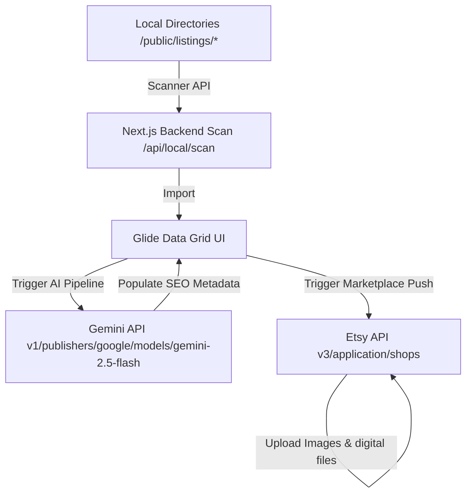

# Workstation V2

A high-performance grid database and management interface designed for aggressive e-commerce asset generation and automated marketplace synchronization.

It ingests local product folders, detects assets, utilizes the Google Gemini API to generate fully optimized SEO metadata (titles, descriptions, tags, alt text, taxonomy properties), and pushes them directly to the target Etsy store.

---

## Architecture & Data Flow



### 1. Spreadsheet Grid & Preset Engine
- **Glide Data Grid:** High-performance canvas-based grid capable of handling hundreds of rows and columns synchronously.
- **Custom Bubble/Dropdown Cells:** Injected custom cell renderers for status visualization, Etsy categories, section mappings, color codes, and seasonal taxnomoy properties.
- **Listing Presets:** Instantly load categories, prices, quantities, listing profiles, and AI instructions for bulk listing generation.

### 2. Digital Asset Pipeline
- **Auto Folder Scan:** Imports folder structures under `public/listings/`.
- **Preview Compression:** Detects listing images and automatically downscales files >5MB into fast-loading JPEGs using `sharp` to stay under Etsy API limits.
- **Digital Delivery Bundle:** Automatically scans the subdirectory `/digital/` inside each listing folder, aggregates the digital downloads, and prepares them for listing attachments.

---

## Directory Structure

```
workstation-v2/
├── src/
│   ├── app/
│   │   ├── api/
│   │   │   ├── assets/       # Scans folders for listing images and videos
│   │   │   ├── etsy/
│   │   │   │   ├── push/     # Authenticates and publishes draft listings/files to Etsy
│   │   │   │   └── shop/     # Validates Etsy shop connection status
│   │   │   └── generate/     # Injects prompts + images into Gemini API for metadata
│   │   ├── globals.css       # Tailwind base styles and custom overrides
│   │   ├── layout.tsx        # HTML wrapper with toast alerts and font definitions
│   │   └── page.tsx          # Landing workspace component composition
│   ├── components/
│   │   ├── FolderImporterModal.tsx  # Modal to choose folders to scan and apply presets
│   │   ├── PresetManagerModal.tsx   # Management UI for default prices, tags, and AI rules
│   │   ├── Sidebar.tsx              # Sidebar containing store connection status
│   │   └── SpreadsheetGrid.tsx      # Main Glide Data Grid database workspace
│   ├── hooks/
│   │   ├── useAIPipeline.ts  # Logic for queuing requests to Gemini API
│   │   └── useEtsyPush.ts    # Logic for bulk pushing metadata/files to Etsy
│   └── lib/
│       └── etsyConstants.ts  # Registry for categories, colors, occasions, and subjects
├── public/
│   └── listings/             # Storefront asset sources (Blink 182, Dexter, skull-shirt)
├── package.json
└── tsconfig.json
```

---

## Local Development

1. **Install Dependencies:**
   ```bash
   npm install
   ```

2. **Configure Environment Variables:**
   Create a `.env.local` file at the root of the project:
   ```env
   # Gemini API Key
   GOOGLE_API_KEY=your_gemini_key_here

   # Etsy OAuth2 Keys (V3 API)
   ETSY_API_KEY=your_etsy_client_id
   ETSY_SHARED_SECRET=your_etsy_secret_key
   ETSY_REFRESH_TOKEN=your_refresh_token
   ETSY_SHOP_ID=your_shop_id
   ```

3. **Spin Up the Server:**
   ```bash
   npm run dev
   ```
   Open [http://localhost:3000](http://localhost:3000) to access the workstation database.

---

## Important Usage Notes
- **Etsy COMPLIANCE:** Titles must be strictly 140 characters or less. The AI pipeline enforces this and handles automatic downcasing/conversion of acronym clusters (e.g. converting `SVG PNG` to `Svg Png`) since Etsy rejects titles containing excessive uppercase terms.
- **File Limits:** Etsy limits digital downloads to a maximum of 5 files per listing and listing images to 10. The automation pipelines truncate files automatically when exceeding these limits.
- **Git Ignore Safeguards:** All runtime error logs (`latest_error.json`) and raw asset listings (`public/listings/*`) are configured in `.gitignore` to prevent leakage of live e-commerce inventory or API credentials.
